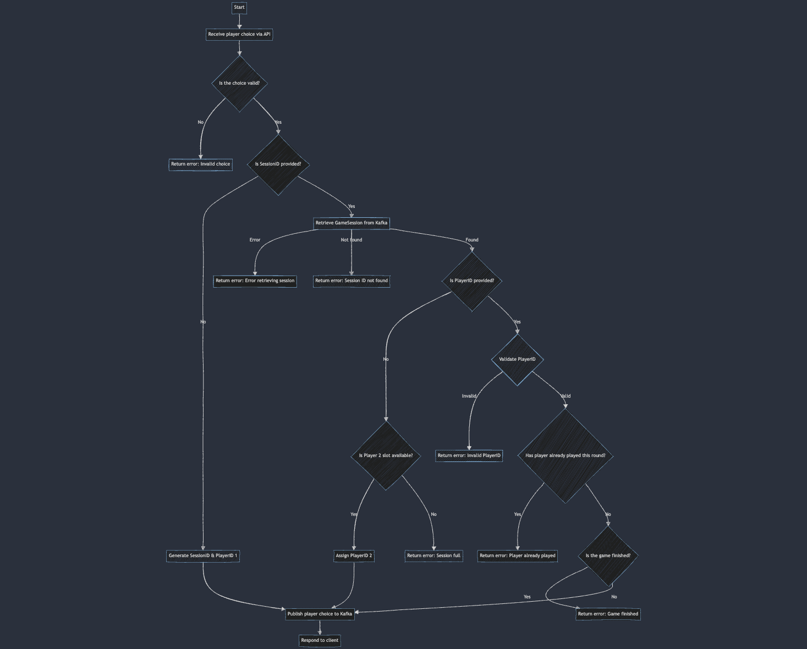

# Shifumi Game 🪨📄✂️

Welcome to the Shifumi Game! This is a simple implementation of the classic Rock-Paper-Scissors game using Go and Kafka.

## How to Play 🎮

1. **Launch the Game**:
   First, ensure you have Docker and docker-compose installed and running. Then, use the following command to start the game using `docker-compose`:

   ```
   cd deploy/docker
   docker-compose up -d
   ```

2. **Start a New Game Session**:
   To start a new game session, the first player (Player 1) needs to make their choice. This will create a new session ID.

   ```
   curl -X POST -H "Content-Type: application/json" -d '{"choice":"rock"}' http://localhost:8081/play
   ```

   **Server Response:**

   ```json
   {
     "session_id": "LKiRsa35Ov",
     "player_id": "1",
     "status": "Choice submitted successfully"
   }
   ```

   This response indicates that a new session has been created with `session_id` "LKiRsa35Ov" and Player ID 1 is assigned.

3. **Player 2 Joins the Game**:
   The second player joins the same session by using the session ID provided in the previous step. Player 2 should specify the session ID and their choice.

   ```
   curl -X POST -H "Content-Type: application/json" -d '{"choice":"scissors", "session_id":"LKiRsa35Ov"}' http://localhost:8081/play
   ```

   **Server Response:**

   ```json
   {
     "session_id": "LKiRsa35Ov",
     "player_id": "2",
     "status": "Choice submitted successfully"
   }
   ```

   Player 2 is now registered in the same session.

4. **Continue Playing**:
   Players continue to play rounds until one of them wins three rounds. **Starting from round 2**, you must specify both the session ID and the player ID since they were allocated during round 1.

   **Player 1's turn in Round 2:**

   ```
   curl -X POST -H "Content-Type: application/json" -d '{"player_id":"1", "choice":"paper", "session_id":"LKiRsa35Ov"}' http://localhost:8081/play
   ```

   **Player 2's turn in Round 2:**

   ```
   curl -X POST -H "Content-Type: application/json" -d '{"player_id":"2", "choice":"rock", "session_id":"LKiRsa35Ov"}' http://localhost:8081/play
   ```

5. **Winning the Game**:
   The game ends when one player wins three rounds. The server will notify both players when the game is over.

   **Example of the final round for Player 1:**

   ```
   curl -X POST -H "Content-Type: application/json" -d '{"player_id":"1", "choice":"rock", "session_id":"LKiRsa35Ov"}' http://localhost:8081/play
   ```

   **Server Response:**

   ```json
   {
     "session_id": "LKiRsa35Ov",
     "player_id": "1",
     "status": "Choice submitted successfully"
   }
   ```

You can check on /stats to see that the game has been won by player 1 or in the server logs. Alternatively, if you're trying to play again, the server will display the following message: "Game has already finished. Player 1 won!"

To query the /stats endpoint, run:

```
curl http://localhost:8082/stats
```

## 🧠 Game Logic

The game operates on a simple turn-based system where two players make their choices in each round. Once both players have submitted their choices, the server determines the winner based on the classic rock-paper-scissors rules.

### 🛠 Workflow Description

1. **Player 1 Initiates the Game:**
   - Player 1 sends a request to `/play` with a move (e.g., `rock`).
   - The client service generates a session ID, allocates Player ID `1`, and publishes the move to the Kafka `player-choices` topic.

2. **Player 2 Joins the Game:**
   - Player 2 sends a request to `/play` with the session ID.
   - The client service allocates Player ID `2` and publishes the move to the Kafka `player-choices` topic.

3. **Server Processes the Choices:**
   - The server service listens to the `player-choices` topic.
   - When both players have submitted their moves, the server determines the winner and publishes the result to the Kafka `game-results` topic.

4. **Check Game Status:**
   - The client or any interested party can check the game status by querying the `/stats` endpoint.
   - The stats are read from the Kafka `game-results` topic.

## Project Structure 🏗️

- **api/client/**: Contains the client-side code to interact with the server.
- **api/server/**: Contains the server-side code that handles game logic.
- **cmd/server/**: The entry point for the server application.

## 🏛️ Architecture

The Shifumi Game is composed of the following components:

- **Client Service:** This service handles player interactions. Players make their moves by sending HTTP requests to the `/play` endpoint. The client service generates session IDs, allocates player IDs, writes to the Kafka `player-choices` topic, and reads from the Kafka `game-results` topic to retrieve the game state.

- **Server Service:** The server is responsible for the game logic. It processes player moves by reading the Kafka `player-choices` topic, determining the round winner, and writing the results to the Kafka `game-results` topic. It also provides a `/stats` endpoint to monitor the game state in real-time.

- **Kafka:** Kafka acts as the messaging backbone for the game, facilitating communication between the client and server services. It ensures that player moves and game results are consistently and reliably transmitted.

### Client logic



### Notes on Scalability

This application is a demonstration of asynchronous microservices using Kafka. It is not designed for scalability or production use but serves as a fun and educational example of how microservices can be orchestrated using Kafka as a streaming messaging system.

## License 📄

This project is licensed under the MIT License - see the [LICENSE](LICENSE) file for details.

## Contributing 🤝

Feel free to open issues or submit pull requests if you have any ideas or improvements!
